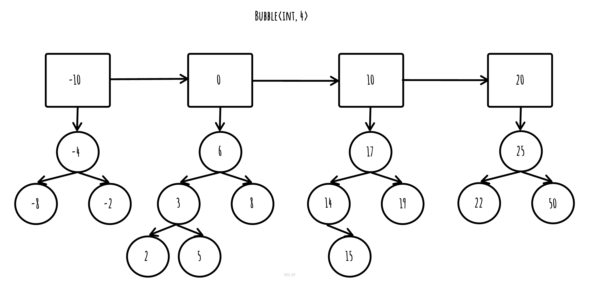

### bubble: A new data structure based on the idea of fibonacci heaps


## Overiew
bubble is a data structure that uses an array and avl trees to store elements. You have to define
an initial size(like bubble<int, 5>) and once the array of size=5 is full, then the next elements
are going to be inserted inside avl trees.
The code is header-only and only relies on STL, except from the avl_tree.hpp header that is implemented inside the
```src/``` folder, though you can just put it inside the ```bubble.h``` file and be just fine.
Note that you can put any binary tree structure you like instead of an avl tree, bubble is generic. \
You can check more about the container at the [tutorial](/tutorial) folder

## Complexity
The time complexity of insertion, deletion and searching of an element is $O(logn + logm) == O(log(n+m))$ where n is the
initial array size and m is the size of the avl tree that the key is going to be.

## Example
```cpp
#include "src/bubble.h"

int main() {
    bubble<int, 5> b;
    b.insert(-20, -10, 0, 10, 20);
    b.insert(15, 16, -5, -6);
    assert(b.search(15) == true);
    b.remove(15);
    assert(b.search(15) == false);
    std::vector<int> elements = b[3]; // returns {15, 16}

    std::cout << b  << '\n'; // custom ostream operator
}
```

## Licence
The code is licenced under the [MIT Licence](http://opensource.org/licenses/MIT):
Copyright &copy; 2024 Spiros Maggioros

Please cite the creators if you want to include this code to a project or a product using the
bibitex bellow or using "Cite this repository" at "about" on the right view panel.
```
@software{Spiros_bubble_A_new_2024,
author = {Spiros, Maggioros},
month = aug,
title = {{bubble: A new data structure based on the idea of fibonacci heaps}},
url = {https://github.com/spirosmaggioros/bubble},
version = {0.0.1},
year = {2024}
}
```


## Run unit tests
To run unit tests on Unix based systems, just do
```bash
mkdir build && cd build
cmake ..
make
cd tests && ./runUnitTests
```

## Contribute
General contributions are always welcome and we definetely need more people working on this to make
sure to have no bugs and manage to have the fastest implementation that we can. In order to contribute just
create a pull request explaining your addition or fix as clearly as you can.
